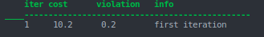
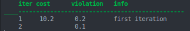
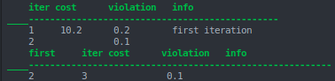
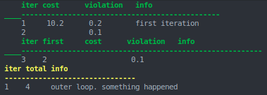
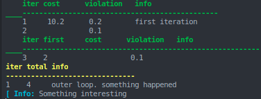

[](https://travis-ci.com/bjack205/SolverLogging.jl)

# SolverLogging.jl
This package is built to output tabularized logging information from possibly different levels during an optimization solve.
Each logging level has an associated set of fields that can be written to between outputs to the terminal, when all the fields
are printed on a single line.

## Getting Started

### Starting with a Empty Solver
The easiest way to get started is by building a solver with "empty" levels.
```julia
logger = SolverLogger(InnerLoop)
add_level!(logger, InnerLoop, print_color=:green, indent=4)
add_level!(logger, OuterLoop, print_color=:yellow)
```
The first line creates a new `SolverLogger` with a minimum print level of `InnerLoop`. The next two lines "register" two
different log levels with the logger, and specify the color and indentation of the output.

We can now log a few pieces of data we'd like to output at the current iteration
```julia
with_logger(logger) do
    @logmsg InnerLoop :iter value=1 width=4
    @logmsg InnerLoop :cost value=10.2 width=10
    @logmsg InnerLoop :violation value=0.2 width=12
    @logmsg InnerLoop "first iteration"
end
```


Here we're specifying that the data correspond to the log level `InnerLoop`, followed by the name of the field, and then
it's value and width. The last log event corresponds to the special "info" field that is used whenever a string is passed
instead of a symbol.

We now print the header row and the data row by specifying the log level we wish to print:
```julia
print_header(logger, InnerLoop)
print_row(logger, InnerLoop)
```


This prints the current data to the console and caches the current values. We can now add data for the next iteration
and print again:
```julia
with_logger(logger) do
    @logmsg InnerLoop :iter value=2
    @logmsg InnerLoop :violation value=0.1
end
print_row(logger, InnerLoop)
```


Note that we don't have to send data to every field: if nothing is sent it will simply print blank.

Let's say we now want to log a new piece of information and want it to print second. We can do this by simply logging
the new field and using the `loc` keyword that specifies the column of the new entry
```julia
with_logger(logger) do
    @logmsg InnerLoop :iter value=3
    @logmsg InnerLoop :violation value=0.1
    @logmsg InnerLoop :first value=2 width=10 loc=2
end
print_header(logger, InnerLoop)
print_row(logger, InnerLoop)
```


### Additional Log Levels
We can, at any time, log information to a different level:
```julia
with_logger(logger) do
    @logmsg OuterLoop :iter value=1 width=4
    @logmsg OuterLoop :total value=4 width=4
    @logmsg OuterLoop "outer loop"
    @logmsg OuterLoop "something happened"
end
print_header(logger, OuterLoop)
print_row(logger, OuterLoop)
```


Here we simply log a different level with new fields and widths and request to print the new level. Note that the special
"info" field can be sent multiple strings, which are simply joined when sent to the output. All other fields replace the
current data if the are written to more than once between output events.

### Unregistered Log Levels
If a log level is used that isn't "registered" with the logger, it is sent to `logger.default_logger`.
```julia
@info "Something interesting"
```

The default logger can be changed using the corresponding keyword argument:
```julia
SolverLogger(minlevel, default_logger=ConsoleLogger(stderr, minlevel))
```

## Accessing the Cached Values
By default, the logger will cache all the data sent to the output. This can be useful if you want to generate a plot of the
values per iteration at the end of the solve. If we want all the cost values for the inner loop we can retrieve them with:
```julia
logger.leveldata[InnerLoop].cache[:cost]
```

The cache can be cleared for a given level using
```julia
SolverLogger.clear_cache!(logger.leveldata[loglevel])
```

## More Examples
See `examples/` for more examples.
